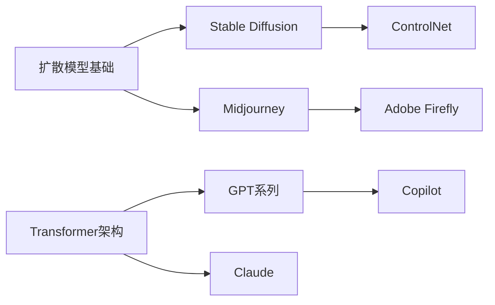

# AIGC（人工智能生成内容）

## 概述

> **AIGC**（AI-Generated Content，人工智能生成内容）是指利用人工智能技术自动创作文本、图像、音频、视频等多种形式内容的新兴领域。它正在深刻改变内容创作的方式和效率。

## 核心概念

### 定义

AIGC 是继 **PGC**（专业生成内容）和 **UGC**（用户生成内容）之后的第三种内容生成模式，代表了 AI 技术在创意领域的重大突破。

### 技术分类

| 类别 | 代表技术 | 应用场景 |
|------|----------|----------|
| **文生文** | GPT-4、Claude、Llama | 写作助手、对话系统 |
| **文生图** | Stable Diffusion、Midjourney、DALL-E 3 | 插画、海报、设计 |
| **文生视频** | Sora、Runway、Pika | 视频创作、短视频 |
| **代码生成** | Copilot、Cursor | 编程辅助 |
| **声音合成** | ElevenLabs、SV2TTS | 配音、语音克隆 |
| **3D生成** | Point-E、DreamFusion | 3D建模、游戏资产 |

## 技术底座

### 扩散模型（Diffusion Model）

扩散模型是目前 AIGC 图像和视频生成的主流架构，通过逐步去噪从随机噪声中恢复出目标图像。

```python
# 简化的扩散模型前向过程
def forward_diffusion(x_0, t):
    """逐步添加噪声"""
    noise = torch.randn_like(x_0)
    alpha_bar = compute_alpha_bar(t)
    x_t = torch.sqrt(alpha_bar) * x_0 + torch.sqrt(1 - alpha_bar) * noise
    return x_t
```

### 大语言模型（LLM）

大语言模型是文生文的核心技术，通过预测下一个 token 生成文本：

$$
P(x_{t+1}|x_t, x_{t-1}, ..., x_0) = \text{softmax}(W \cdot h_t)
$$

### CLIP（对比语言-图像预训练）

CLIP 连接文本和图像理解的桥梁，实现"文生图"的可能。通过对比学习，让模型理解文本和图像的对应关系。

## 工具生态

### 文生图工具对比

| 工具 | 特点 | 适用场景 |
|------|------|----------|
| **Midjourney** | 艺术风格强、Discord 生态 | 创意艺术、概念设计 |
| **Stable Diffusion** | 开源可定制、本地部署 | 二次创作、定制模型 |
| **DALL-E 3** | OpenAI 安全过滤 | 商业插画、快速原型 |

### 文生文工具对比

| 工具 | 特点 | 适用场景 |
|------|------|----------|
| **ChatGPT** | 通用对话、多模态 | 日常助手、内容创作 |
| **Claude** | 长上下文、安全 | 文档处理、代码辅助 |
| **Gemini** | Google 生态、多模态 | 搜索增强、数据分析 |

### 视频生成工具

| 工具 | 特点 | 最长时长 |
|------|------|----------|
| **Sora** | OpenAI、逼真物理 | 60秒 |
| **Runway** | 专业创作、生态 | 16秒 |
| **Pika** | 简单易用、快速 | 3秒 |

## 应用场景

### 内容创作革命

1. **效率提升**：传统 1 天的设计工作，AI 可在 1 小时内完成
2. **成本降低**：无需专业技能，普通人也能创作高质量内容
3. **个性化定制**：根据用户喜好实时生成定制内容

### 典型案例

- 📝 **营销文案**：AI 根据产品特点自动生成多版本文案
- 🎨 **电商主图**：AI 生成符合品牌调性的商品展示图
- 🎬 **短视频脚本**：AI 辅助创作脚本、分镜
- 🧑‍💻 **代码注释**：AI 自动生成代码文档

## 学习路径



## 相关概念

| 概念 | 关系 | 说明 |
|------|------|------|
| [[Stable Diffusion]] | 核心技术 | 开源文生图模型 |
| [[GPT-4]] | 核心技术 | 多模态大语言模型 |
| [[Sora]] | 核心技术 | OpenAI 文生视频 |
| [[扩散模型]] | 技术基础 | 生成模型的主流架构 |
| [[大语言模型]] | 技术基础 | 语言生成的核心 |

## 延伸阅读

- [AIGC 发展史](https://www.example.com/aigc-history) - 从 GAN 到 Diffusion
- [Midjourney 官方文档](https://docs.midjourney.com/) - 提示词指南
- [Stable Diffusion WebUI](https://github.com/AUTOMATIC1111/stable-diffusion-webui) - 本地部署教程

## 学习记录

- [x] 理解 AIGC 的定义和范畴
- [x] 了解主要工具和平台
- [x] 掌握扩散模型的基本原理
- [ ] 完成文生图工具的实操
- [ ] 尝试构建自己的 AIGC 工作流

---

*💡 提示：AIGC 领域发展迅速，建议关注 Stability AI、OpenAI、Anthropic 等公司的最新动态。*
