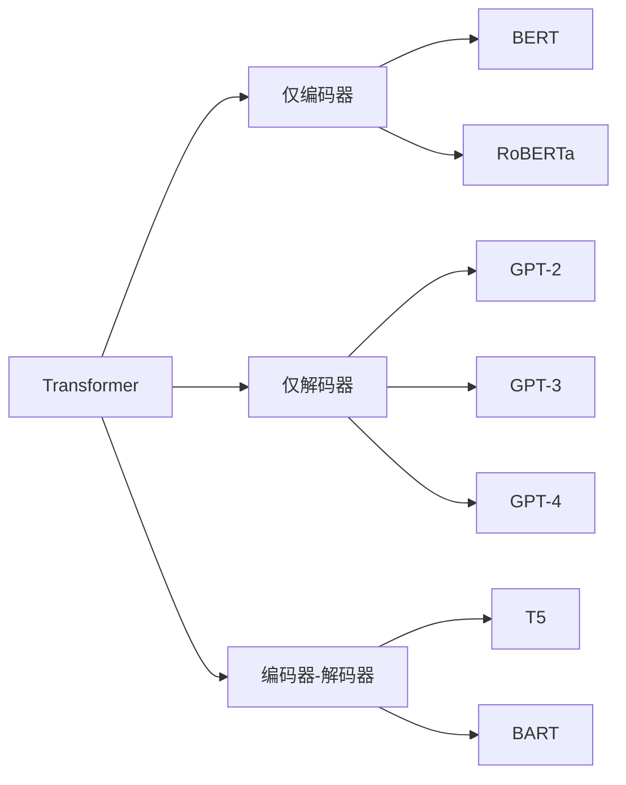

# Transformer（变换器）

## 概述

> **Transformer** 是一种基于**自注意力机制**（Self-Attention）的神经网络架构，由 Google 在 2017 年论文《Attention Is All You Need》中提出。它彻底改变了自然语言处理（NLP）领域，开启了大语言模型时代。

## 核心概念

### 定义

Transformer 是一种完全基于**注意力机制**（Attention Mechanism）的序列到序列（Seq2Seq）模型，抛弃了传统的 RNN、CNN 结构，实现了并行计算和长距离依赖建模。

### 核心组件

| 组件 | 功能 | 关键创新 |
|------|------|----------|
| **自注意力层** | 建立序列内任意位置的联系 | O(1) 路径长度 |
| **多头注意力** | 捕获多种关系模式 | 多子空间并行学习 |
| **位置编码** | 注入序列顺序信息 | 正弦/余弦编码 |
| **前馈网络** | 非线性变换 | FFN 子层 |
| **层归一化** | 稳定训练 | LayerNorm |

### 工作原理

1. **输入嵌入**：将 token 转换为向量表示
2. **位置编码**：添加位置信息到嵌入向量
3. **多头自注意力**：计算序列内各位置的关联强度
4. **残差连接**：缓解深层网络梯度问题
5. **前馈网络**：逐位置非线性变换
6. **输出层**：生成最终预测概率

## 详细说明

### 注意力机制数学表达

$$
\text{Attention}(Q, K, V) = \text{softmax}\left(\frac{QK^T}{\sqrt{d_k}}\right)V
$$

其中：
- **Q**（Query，查询向量）：表示当前位置"想要寻找什么"
- **K**（Key，键向量）：表示每个位置"包含什么信息"
- **V**（Value，值向量）：表示每个位置的"实际内容"

### 多头注意力

$$
\text{MultiHead}(Q, K, V) = \text{Concat}(\text{head}_1, \ldots, \text{head}_h)W^O
$$

其中每个 $\text{head}_i = \text{Attention}(QW_i^Q, KW_i^K, VW_i^V)$

### 代码实现

```python
import torch
import torch.nn as nn
import math

class MultiHeadAttention(nn.Module):
    def __init__(self, d_model, num_heads):
        super().__init__()
        assert d_model % num_heads == 0

        self.d_k = d_model // num_heads
        self.num_heads = num_heads

        self.W_q = nn.Linear(d_model, d_model)
        self.W_k = nn.Linear(d_model, d_model)
        self.W_v = nn.Linear(d_model, d_model)
        self.W_o = nn.Linear(d_model, d_model)

    def forward(self, x):
        batch_size = x.size(0)

        # 线性变换后分头
        Q = self.W_q(x).view(batch_size, -1, self.num_heads, self.d_k).transpose(1, 2)
        K = self.W_k(x).view(batch_size, -1, self.num_heads, self.d_k).transpose(1, 2)
        V = self.W_v(x).view(batch_size, -1, self.num_heads, self.d_k).transpose(1, 2)

        # 注意力计算
        scores = torch.matmul(Q, K.transpose(-2, -1)) / math.sqrt(self.d_k)
        attn_weights = torch.softmax(scores, dim=-1)
        context = torch.matmul(attn_weights, V)

        # 合并多头
        context = context.transpose(1, 2).contiguous().view(batch_size, -1, self.num_heads * self.d_k)
        return self.W_o(context)
```

## 应用场景

- **机器翻译**（Google 翻译、DeepL）
- **文本生成**（GPT 系列、BERT）
- **文本分类**（情感分析、意图识别）
- **问答系统**（ChatGPT、Claude）
- **代码生成**（Copilot、Cursor）
- **图像生成**（ViT、DALL-E）

## 家族谱系



## 相关概念

| 概念 | 关系 | 说明 |
|------|------|------|
| [[自注意力]] | 核心技术 | Transformer 的核心机制 |
| [[多头注意力]] | 变体 | 多头注意力增强表达 |
| [[位置编码]] | 辅助技术 | 位置信息注入 |
| [[BERT]] | 下游应用 | 仅编码器架构 |
| [[GPT]] | 下游应用 | 仅解码器架构 |

## 延伸阅读

- [Attention Is All You Need](https://arxiv.org/abs/1706.03762) - 原始论文
- [The Illustrated Transformer](https://jalammar.github.io/illustrated-transformer/) - 可视化解读
- [Harvard NLP Annotated Transformer](http://nlp.seas.harvard.edu/annotated-transformer/) - 带注释实现

## 学习记录

- [x] 初步了解 Transformer 的基本结构
- [x] 理解自注意力机制原理
- [x] 掌握多头注意力的实现
- [ ] 能够从零实现简易 Transformer
- [ ] 理解位置编码的设计动机

---

*💡 提示：Transformer 是现代大语言模型的基础，建议深入学习其注意力机制的细节。*
