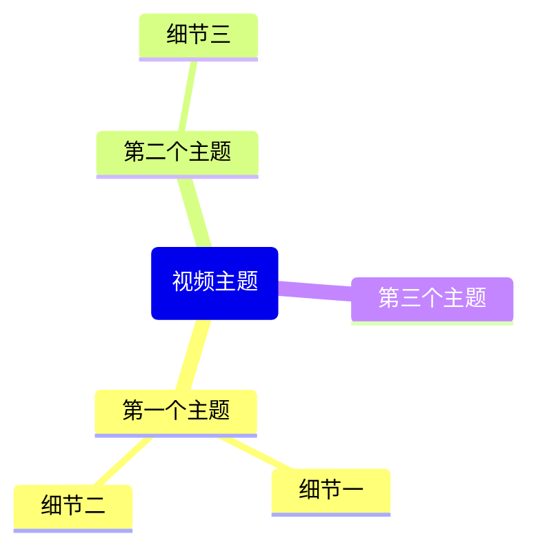

根据上下文中提供的 YouTube 视频信息和字幕，生成以下格式的完整 Obsidian 笔记。

重要提示：如果没有找到 YouTube 视频上下文，请提醒用户：
1. 在网页视图中打开 YouTube 视频（或使用 @ 选择 YouTube 网页标签）
2. 然后再次使用此命令

按照以下结构生成笔记：

---
title: "<视频标题>"
description: "<描述的前 200 个字符>"
channel: "<频道名称>"
url: "<视频网址>"
duration: "<时长>"
published: <上传日期，YYYY-MM-DD 格式>
thumbnailUrl: "<YouTube 缩略图网址：i.ytimg.com/vi/VIDEO_ID/maxresdefault.jpg，使用 https 协议>"
genre:
  - "<分类>"
watched:
---

> [!summary]- 描述
> <完整视频描述，保留换行>

## 摘要

<视频内容的简要 2-3 段摘要>

## 关键要点

<5-8 个关键要点列表>

## 思维导图

重要 Mermaid 思维导图语法规则 - 必须严格遵守：
- 根节点格式：root(主题名称) - 使用圆括号，不要用双括号
- 子节点：只需纯文本，不需要括号
- 不要在文本中使用引号、括号或其他特殊字符
- 不要使用图标或表情
- 保持所有节点文本简短 - 每个节点最多 3-4 个词
- 只使用字母、数字和空格

正确语法示例：

## 精选引用

<5-10 个精选引用，格式如下：>
- [<时间戳>: <引用文本>](<视频网址>&t=<秒数>s)

只返回 Markdown 内容，不要包含任何解释或评论。
