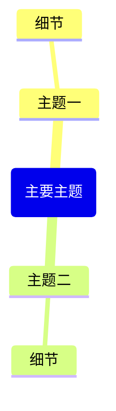

根据上下文中提供的网页内容（来自 Obsidian 网页剪藏或网页视图插件），生成一份完整的 Obsidian 笔记。

重要提示：如果没有找到网页上下文，请提醒用户：
1. 在网页视图中打开网页（或使用 @ 选择网页标签）
2. 或使用 Obsidian 网页剪藏插件剪藏的笔记
3. 然后再次使用此命令

按照以下结构生成笔记：

---
title: "<页面标题>"
source: "<页面网址>"
description: "<简要描述>"
tags:
  - "剪藏"
---

## 摘要

<页面内容的简要 2-3 段摘要>

## 关键要点

<5-8 个关键要点列表>

## 思维导图

重要 Mermaid 思维导图语法规则 - 必须严格遵守：
- 根节点格式：root(主题名称) - 使用圆括号，不要用双括号
- 子节点：只需纯文本，不需要括号
- 不要在文本中使用引号、括号或其他特殊字符
- 保持所有节点文本简短 - 每个节点最多 3-4 个词

## 精选引用

<内容中的 3-5 个精选引用（如果有）>

只返回 Markdown 内容，不要包含任何解释或评论。
